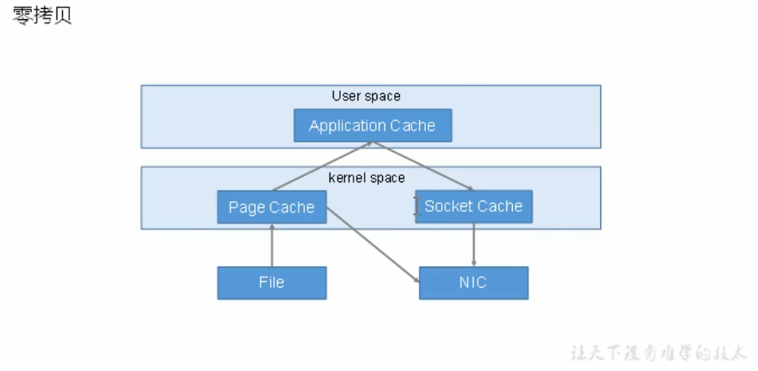
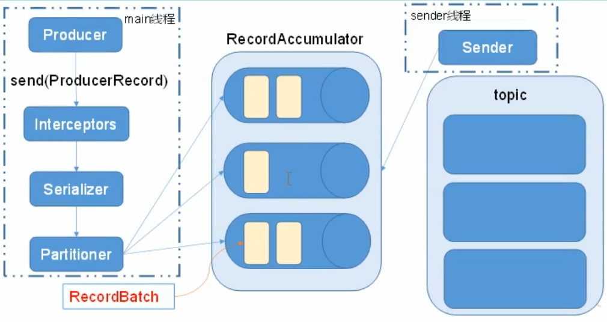

### 1、消息队列的两种模式

> - 点对点模式（一对一，消费者主动拉去数据，消息收到后消息清除），主动拉取数据的话消费者需要维护长轮询，消耗资源
> - 发布/订阅模式（一对多，消费者消费数据之后不会清除消息），推送数据的话生产者需要维护一个消费者的列表以供按照每个消费者的消费速度主动推送给每个消费者

### 2、安装kafka，修改server.properties

	broker.id=0
	delete.topic.enable=true
	log.dirs=/opt/module/kafka/data
	zookeeper.connect=hadoop101:2181
	
### 3、启动kafka（-daemon启动守护进程）

	bin/kafka-server-start.sh -daemon config/server.properties

### 4、群启kafka脚本

    ```xml
        #!bin/bash

        case $1 in
        "start"){
            for i in hadoop102 hadoop103 hadoop104
            do
                echo "************$1**********"
                ssh $i "/opt/module/kafka/bin/kafka-server-start.sh -daemon /opt/module/kafka/config/server.properties
            done
        };;;

        "stop"){
            for i in hadoop102 hadoop103 hadoop104
            do
                echo "************$1**********"
                ssh $i "/opt/module/kafka/bin/kafka-server-stop.sh  /opt/module/kafka/config/server.properties
            done
        };;;

        esac
    ```

### 5、查看进程

    xcall.sh jps

### 6、topic

查看topic：bin/kafka-topics.sh --list --zookeeper hadoop102:2181

创建topic：bin/kafka-topics/sh --create --zookeeper hadoop102:2181 --topic first --partitions 2 --replication-factor 2

**partitions分区数为2
replication-factor副本数为2，小于等于broker数量，副本数作为备份**

删除topic：bin/kafka-topics.sh --delete --zookeeper hadoop102:2181 --topic first

查看topic详情：bin/kafka-topics.sh --describe --topic first --zookeeper hadoop102:2181


### 7、启动生产者控制台

bin/kafka-console-producer.sh --topic first --broker-list hadoop102:9092

### 8、启动消费者控制台模式

bin/kafka-console-consumer.sh --topic first --zookeeper hadoop102:2181

**kafka 0.9版本以前存在zookeeper中，0.9版本以后存在本地kafka，使用boostrap-server 替代zookeeper（bin/kafka-console-consumer.sh --topic first --boostrap-servereper hadoop102:2181）**

### 9、启动消费者控制台从一开始的消息开始查看（查看topic内容）
0.11版本以前：
> bin/kafka-console-consumer.sh --topic first --zookeeper hadoop102:2181 --from-beginning

0.11版本以后：
> bin/kafka-console-consumer.sh --topic first --bootstrap-server hadoop102:2181 --from-beginning

**.log文件中的数据保存最大时间为7天**

### 10、kafka工作流程

> - leader和follower统共两个副本，且follower和leader一定不在同一台broker
> - producer发送消息入kafka集群leader中，leader同步最新消息入follwer，consumer消费leader中的消息

    kafka中消息是以topic进行分类的，生产者生产消息，消费者消费消息，都是面向topic的，topic是逻辑上的概念，而partition分区时物理上的概念，每个partition对应于一个log文件，该log文件中存储的就是producer生产的数据，producer生产的数据会被不断追加到该log文件末端，且每条数据都有自己的offset，消费者组中的每个消费者，都会实时记录自己消费到了哪个offset，以便出错恢复时，从上次的为止继续消费

    一个topic分为多个partition，一个partition分为多个segment，一个segment对应两个文件.log、.index文件，由于生产者生产的数据会不断追加到log文件末尾，为防止log文件过大导致数据定位效率低下，kafka采取了分片和索引机制，将每个partition分为多个segment，每个segment对应两个文件——.index文件和.log文件，这些文件位于一个文件夹下，该文件的命名规则为：topic名称+分区序号，eg.first-0，index和log文件以当前segment的第一条消息的offset命名，index文件中存储偏移量和数据大小，以此来查找log文件中的数据

## kafka生产者

### 11、kafka生产者

1. 分区策略

    分区原因
    > - 方便再集群中扩展，每个partition可以通过调整以适应它所在的机器，而一个topic又可以有多个partition组成，因此整个集群就可以适应任意大小的数据了
    > - 可以提高并发，因为可以以patition为单位读写

    分区原则
    > - 指明partition的情况下，直接指明的值直接作为patition值
    > - 没有指明partition值但有key的情况下，将key的hash值与topic的partition数进行取余得到partition值
    > - 既没有partition值又没有key值的情况下，第一次调用时随机生成一个整数（后面每次调用在这个整数上自增），将这个值与topic可用的partition总数取余得到partition值，也就是常说的round-robin（轮询）算法

### 12、数据可靠性保证（ack为确认消息）

为保证producer发送的数据，能可靠的发送到指定的topic，topic的每个partition收到producer发送的数据后，都需要像producer发送ack（acknowledge 确认收到），如果producer收到ack，就会进行下一轮的发送，否则重新发送数据

1. 半数以上完成同步，就发送ack， 优点 延迟低，缺点 选举新的leader时，容忍n台节点的故障，需要2n+1个副本
2. 全部完成同步，才发送ack， 优点 选举新的leader时，容忍n台节点的故障，需要n+1个副本，缺点 延迟高

kafka选择了第二种方案，原因：
> - 同样为了容忍n台节点的故障，第一种方案需要2n+1个副本，而第二种方案只需要n+1个副本，而kafka的每个分区都有大量的数据，第一种方案会造成大量数据的冗余
> - 虽然第二种那个方案的网络延迟会比较高，但网络延迟对kafka的影响较小

**ISR（同步队列，为了将来选举新的leader）**

采用第二种方案之后，设想以下情景：leader收到数据，所有follower开始同步数据，但有一个follower，因为某种故障，迟迟不能与leader进行同步，那leader就要一直等下去，直到它完成同步，才能发送ack，如何解决？

    leader维护一个动态的in-sync replica set（ISR），意为和leader保持同步的follower集合，当ISR中的follower完成数据的同步之后，leader就会给follower发送ack，如果follower长时间未向leader同步数据，则该follower将被踢出ISR，该时间阈值由replica.lag.time.max.ms（默认时间10秒钟）参数设定，leader发生故障之后，就会从ISR中选举新的leader

**0.9版本移除数据大小配置的参数，保留默认时间配置的参数**

### 13、ack参数配置

    acks：
        0：producer不等待broker的ack，这一操作提供了一个最低的延迟，broker一接收到还没有写入磁盘就已经返回，当broker故障时有可能丢失数据

        1：producer等待broker的ack，partition的leader落盘成功后返回ack，如果在follower同步成功之前leader故障，那么将会丢失数据

        -1（all）：producer等待broker的ack，partition的leader和follower（指ISR队列里的follower）全部罗盘成功后才会返回ack，但是如果在follower同步完成后，broker发送ack之前，leader发生故障，那么会造成数据重复（如果在leader进入ISR队列，而follower因为时间问题未进入ISR，那么也会出现先数据丢失的情况）

### 14、故障处理细节


    为解决ISR队列中leader挂掉后，选取一个follower为新leader，此新的leader与其他的follwer数据不一致的问题：

    LEO（log end offset）：每个副本的最后一个offset
    HW（high watermark）：所有副本中最小的LEO，指的是消费者能见到的最大的offset，ISR队列中最小的LEO

**HW之前的数据才对consumer可见，也就是HW只能保证消费者消费数据的一致性，生产者的一致性由ack保证**

1. follower故障

    follower发生故障后会被临时踢出ISR，待该follower恢复后，follower会读取本地磁盘记录的上次的HW，并将log文件高于HW的部分截取掉，从HW开始向leader进行同步，等该follower的LEO大于等于该partition的HW，即follower追上leader之后，就可以重新加入ISR了

2. leader故障

    leader发生故障之后，会从ISR中选出一个新的leader，之后，为保证多个副本之间的数据一致性，其余的follower会先将各自的log文件高于HW的部分截掉，然后从新的leader同步数据到其他的follower后面

**注意：这只能保证副本之间的数据一致性，并不能保证数据不丢失或者不重复**

### 15、Exactly Once语义

> - At Least Once：将服务器的ACK级别设置为-1，可以保证Producer到Server之间不会丢失数据
> - At Most Once：将服务器ACK级别设置为0，可以保证生产者每条消息只会被发送一次
> - Exactly Once：

At Least Once可以保证数据不丢失，但是不能保证数据不重复，相对的，At Most Once可以保证数据不重复，但是不能保证数据不丢失，但是，对于一些非常重要的信息，比如说交易数据，下游数据消费者要求既不重复也不丢失，即Exactly Once语义，在0.11版本以前的kafka，对此是无能为力的，只能保证数据不丢失，再在下游消费者对数据做全局去重，对于多个下游应用的情况，每个都需要单独做全局去重，这就对性能造成了很大影响，0.11版本的kafka引入一项重要特性：**幂等性**，所谓的幂等性就是指producer不论向server发送多少次重复数据，server端只会持久化一条，幂等性结合At Least Once语义，就构成了kafka的Exactly Once语义，即：**At Least Once + 幂等性 = Exactly Once**，要启用幂等性，将Producer的参数中enable.idompotence设置为true即可（即ack默认为-1了），kafka的幂等性实现其实就是将原来下游需要做的去重放在了数据上游，开启幂等性的producer在初始化的时候会被分配一个PID（producer id），发往同一partition的消息会附带sequence Number，而broker端会对<PID，Partition，SeqNumber>为主键做缓存，当具有相同主键的消息提交时，broker只会持久化一条。
但是PID重启就会变化，同时不同的partition也具有不同主键，所以幂等性无法保证跨分区跨会话的Exactly Once

## kafka消费者

### 16、消费方式
> - **concumer采用pull（拉）模式从broker中读取数据，push（推）模式很难适应消费速率不同的消费者，因为消息发送速率是由broker决定的**，他的目标是尽可能以最快速度传递消息，但是这样很容易造成consumer来不及处理消息，典型的表现就是拒绝服务以及网络拥塞，而pull模式则可以根据consumer的消费能力以适当的速率消费消息，**pull模式不足之处是，如果kafka没有数据，消费者可能会陷入循环中，一直返回空数据**，针对这一点，kafka的消费者在消费数据会传入一个时长参数timeout，如果当前没有可供消费，consumer会等待一段时间之后再返回，这段时长即为timeout。

### 17、分区分配策略

一个consumer group中有多个consumer，一个topic有多个partition，所以必然会涉及到partition的分配问题，即确定哪个partition由哪个consumer来消费，**kafka有两种分配策略，一个是RoundRobin（轮询），一个是Range（范围）**

RoundRobin按照组来区分(并且消费者组内的消费者订阅的都是同一个topic)，Range按照主题topic来区分，默认Range策略，但Range可能会导致不同组的消费者消费数据不对等的情况

**Range按照topic来区分分区分配，谁订阅了该topic，该topic就把分区分配给该订阅者**

### 18、offset的维护（保存在zk || kafka本地）

由于consumer在消费过程中可能会出现断电宕机等故障，consumer恢复后，需要从故障前的位置继续消费，所以consumer需要实时记录自己消费到了哪个offset，以便故障恢复后继续消费。

针对zk（zookeeper）：**消费者组+主题+分区**确定offset，同一个组的消费者会接着消费分区下的数据，同一个组名取的offset

针对kafka本地（bootstrap-server）：kafka0.9版本之前，consumer默认将offset保存在zookeeper中，从0.9版本开始，consumer默认将offset保存在kafka一个内置的topic中，该topic为_consumer_offsets。
> - 修改配置文件consumer.properties：exclude.internal.topics=false
> - 读取offset：
>> - **0.11.0.0之前版本：bin/kafka-console-consumer.sh --topic __consumer_offsets --zookeeper hadoop102:2181 --formatter "kafka.coordinator.GroupMetadataManager\$offsetsMessageFormatter" --consumer.config config/consumer.properties --from-beginning**
>> - **0.11.0.0之后版本(含)：bin/kafka-console-consumer.sh --topic __consumer_offsets --zookeeper hadoop:2181 --formatter "kafka.coordinator.group.GroupMetadataManager\$offsetsMessageFormatter" --consumer.config config/consumer.properties --from-begining**

**不同组的消费者可以消费同一条消息，同一个组的消费者按轮询分配，如果假如一个新的分区，则会重新为当前所有分区（包括新分区）按轮询分配消息**

### 19、kafka高效读写数据

1. 顺序写磁盘

    kafka的producer生产数据，要写入到log文件中，写的过程是一直追加到文件末端，为顺序写，官网有数据表明，同样的磁盘，顺序写能到600M/s，而随机写只有100K/s。这与磁盘的机械机构有关，顺序写之所以快，是因为其省去大量磁头寻址的时间

2. 零复制技术（零拷贝） 

    原先的传输方式：文件file读入kernel space（操作系统）-> user space（用户空间,Application Cache（应用代码）） -> kernal space -> NIC

    零拷贝传输：file -> kernel space -> NIC
    


参考：https://blog.csdn.net/ljheee/article/details/99652448

### 20、zookeeper在kafka中的作用

kafka集群中有一个broker会被选举为controller，负责管理集群broker的上下线，所有topic的分区副本分配和leader选举等工作。controller的管理工作都是依赖于zookeeper的，选举过程：争抢资源，选取controller，选举leader，选取ISR

### 21、kafka事务

kafka从0.11版本开始引入事务支持，事务可以保证kafka在Exactly Once语义的基础上，生产和消费可以跨分区和会话，要么全部成功，要么全部失败

### 22、Prodecer事务（结合幂等性阐述，保证数据精准一致性写入）

为了实现跨分区跨会话的事务，需要引入一个全局唯一的Transaction ID（客户端提供的），并将Producer获得的PID和Transaction ID绑定，这样当Producer重启后就可以通过正在进行的Transaction ID获得原来的PID。为了管理Transaction，kafka引入了一个新的组件Transaction Coordinator，producer就是通过和Transaction Coordinator交互获得Transaction ID对应的任务状态。Transaction Coordinator还负责将事务所有写入kafka的一个内部Topic，这样即使整个服务重启，由于事务状态得到保存，进行中的事务状态可以得到恢复，从而继续进行。

### 23、Consumer事务（offset可以手动修改，所以consumer事务无法确认，仅了解）

上述事务机制主要是从producer方面考虑，对于consumer而言，事务的保证就会相对较弱，尤其是无法保证commit的信息被精确消费，这是由于consumer可以通过offset访问任意信息，而且不同的segment File生命周期不同，同一事务的消息可能会出现重启后被删除的情况

### 24、Kafka API

1. Producer API

    1.1 消息发送流程

    kafka的producer发送消息采用的是**异步发送**的方式，在消息发送的过程中，涉及到了两个线程——**main线程和sender线程**，以及一个**线程共享变量——RecordAccumulator（行数据的累加器）**，main线程将消息发送给RecordAccumulator，sender线程不断从RecordAccumulator中拉取消息发送到kafka broker（和ack区分，ack保证生产者的发送数据是否丢失的问题，而此处发送为异步发送）。
    **proucer -> interceptors -> serializer -> partitioner -> RecordAccumulator -> sender取出RecordAccumulator的数据 -> kafka的topic**



**小结：哪些follower可以进入ISR，0.9版本之后看同步时间，0.9版本之前还要看数据量，具体详情参考12处，ISR中HW，LEO（同一个分区里面，多个副本，每个副本最后一个offset就是LEO，HW高水位指消费 者可见的最小的offset）概念；观察是否丢失数据或者重复数据，看生产者中的ack机制，保证存储数据一致性，截取HW，新leader的HW后面的补上所有截取后的尾巴**

### 25、自定义存储offset

kafka 0.9版本之前，offset存储在zookeeper 0.9版本及之后，默认将offset存储在kafka的一个内置的topic中，除此之外，kafka还可以选择自定义offset，offset的维护是相当繁琐的，因为需要考虑到消费者的Rebalance。**当有新的消费者加入消费者组，已有的消费者推出消费者或者所订阅的主题的分区发生变化，就会触发到分区的重新非陪，重新分配的过程叫做Rebalance（再平衡）**。消费者发生Rebalance之后，每个消费者消费的分区就会发生变化，**因此消费者要首先获取到自己被重新分配到的分区，并且定位到每个分区最近提交的offset位置继续消费**，要实现自定义存储offset，需要借助ConsumerRebalanceListener

### 26、kafka监控——Eagle

1. 修改kafka启动命令：
vi kafka-server-start.sh

```xml
if [ "x$KAFKA_HEAP_OPTS" = "x" ]; then
    export KAFKA_HEAP_OPTS="-Xmx1G -Xms1G"
fi
```
修改为
```xml
if [ "x$KAFKA_HEAP_OPTS" = "x" ]; then
    export KAFKA_HEAP_OPTS="-server -Xms2G -XX:PermSize=128m -XX:+UseG1GC -XX:MaxGCPauseMillis=200 -XX:ParallelGCThread=8 -XX:ConcGCThreads=5 -XX:InitiatingHeapOccupancyPercent=70"
    export JMX_PORT="9999"
fi
```
**注意：修改之后在启动kafka之前要分发其他节点，分发命令：xsync bin/kafka-server-start.sh**

kafka结合eagle详情自行google


