## 2016版

## 安装
```shell
$ wget http://download.redis.io/releases/redis-5.0.7.tar.gz
$ tar xzf redis-5.0.7.tar.gz
$ cd redis-5.0.7
$ make
```
Redis编译需要以下组件，make，gcc  
进入redis目录后执行make  
```shell
出现以下，则代表未安装gcc
make[3]: Entering directory '/opt/redis-5.0.7/deps/hiredis'
gcc -std=c99 -pedantic -c -O3 -fPIC  -Wall -W -Wstrict-prototypes -Wwrite-strings -g -ggdb  net.c
make[3]: gcc: Command not found
make[3]: *** [Makefile:156: net.o] Error 127
make[3]: Leaving directory '/opt/redis-5.0.7/deps/hiredis'
make[2]: *** [Makefile:46: hiredis] Error 2
make[2]: Leaving directory '/opt/redis-5.0.7/deps'
make[1]: [Makefile:200: persist-settings] Error 2 (ignored)
    CC adlist.o
/bin/sh: 1: cc: not found
make[1]: *** [Makefile:248: adlist.o] Error 127
make[1]: Leaving directory '/opt/redis-5.0.7/src'
make: *** [Makefile:6: all] Error 2

```
```shell
In file included from adlist.c:34:
zmalloc.h:50:10: fatal error: jemalloc/jemalloc.h: No such file or directory
 #include <jemalloc/jemalloc.h>
```

这个错误是由于jemalloc重载了Linux下的ANSI C的malloc和free函数，make的时候添加`make MALLOC=libc`即可  
当出现`Hint: It's a good idea to run 'make test' ;`表示make成功  
进入src，目录，可以删除后缀名为`.c` `.h` `.o`的文件，使得目录整洁点 

## 配置文件
```shell 
daemonize yes 是否在后台执行，是yes，否no
pidfile /var/run/redis/redis.pid redis的进程文件
databases 16 数据库的数量，默认使用的数据库是0。可以通过”SELECT 【数据库序号】“命令选择一个数据库，序号从0开始
RDB持久化规则配置，满足900秒内达到1次更改、300秒内10次更改、60秒内达到10000次更改，就持久化到硬盘
save 900 1 
save 300 10 
save 60 10000 
rdbchecksum yes 是否校验rdb文件;从rdb格式的第五个版本开始，在rdb文件的末尾会带上CRC64的校验和。这跟有利于文件的容错性，但是在保存rdb文件的时候，会有大概10%的性能损耗，所以如果你追求高性能，可以关闭该配置
dbfilename dump.rdb 指定本地数据库文件名，一般采用默认的 dump.rdb
dir /usr/local/redis/var 数据目录，数据库的写入会在这个目录。rdb、aof文件也会写在这个目录
replica-priority 100 当master不可用，Sentinel会根据slave的优先级选举一个master。最低的优先级的slave，当选master 而配置成0，永远不会被选举
requirepass foobared requirepass配置可以让用户使用AUTH命令来认证密码，才能使用其他命令。这让redis可以使用在不受信任的
maxclients 10000 设置能连上redis的最大客户端连接数量。默认是10000个客户端连接。由于redis不区分连接是客户端连接还是内部打开文件或者和slave连接等，所以maxclients最小建议设置到32。如果超过了maxclients，redis会给新的连接发送’max number of clients reached’，并关闭连接
maxmemory 122000000 redis配置的最大内存容量。当内存满了，需要配合maxmemory-policy策略进行处理。注意slave的输出缓冲区是不计算在maxmemory内的。所以为了防止主机内存使用完，建议设置的maxmemory需要更小一些

#内存容量超过maxmemory后的处理策略。
#volatile-lru：利用LRU算法移除设置过过期时间的key。
#volatile-random：随机移除设置过过期时间的key。
#volatile-ttl：移除即将过期的key，根据最近过期时间来删除（辅以TTL）
#allkeys-lru：利用LRU算法移除任何key。
#allkeys-lru：利用LRU算法移除任何key。
#allkeys-random：随机移除任何key。
#noeviction：不移除任何key，只是返回一个写错误。
#上面的这些驱逐策略，如果redis没有合适的key驱逐，对于写命令，还是会返回错误。redis将不再接收写请求，只接收get请求。写命令包括：set setnx setex append incr decr rpush lpush rpushx lpushx linsert lset rpoplpush sadd sinter sinterstore sunion sunionstore sdiff sdiffstore zadd zincrby zunionstore zinterstore hset hsetnx hmset hincrby incrby decrby getset mset msetnx exec sort。
# maxmemory-policy noeviction

appendonly no Redis 默认不开启。它的出现是为了弥补RDB的不足（数据的不一致性），所以它采用日志的形式来记录每个写操作
appendfilename "appendonly.aof" 指定本地数据库文件名，默认值为 appendonly.aof

#aof持久化策略的配置
#no表示不执行fsync，由操作系统保证数据同步到磁盘，速度最快
#always表示每次写入都执行fsync，以保证数据同步到磁盘
#everysec表示每秒执行一次fsync，可能会导致丢失这1s数据
# appendfsync always
appendfsync everysec
# appendfsync no

no-appendfsync-on-rewrite no #fsync会造成阻塞过长时间，no-appendfsync-on-rewrite字段设置为默认设置为no。如果对延迟要求很高的应用，这个字段可以设置为yes，否则还是设置为no，这样对持久化特性来说这是更安全的选择。设置为yes表示rewrite期间对新写操作不fsync,暂时存在内存中,等rewrite完成后再写入，默认为no，建议yes。Linux的默认fsync策略是30秒。可能丢失30秒数据
auto-aof-rewrite-percentage 100 #aof自动重写配置。当目前aof文件大小超过上一次重写的aof文件大小的百分之多少进行重写，即当aof文件增长到一定大小的时候Redis能够调用bgrewriteaof对日志文件进行重写。当前AOF文件大小是上次日志重写得到AOF文件大小的二倍（设置为100）时，自动启动新的日志重写过程
auto-aof-rewrite-min-size 64mb #设置允许重写的最小aof文件大小，避免了达到约定百分比但尺寸仍然很小的情况还要重写
aof-load-truncated yes #aof文件可能在尾部是不完整的，当redis启动的时候，aof文件的数据被载入内存。重启可能发生在redis所在的主机操作系统宕机后，尤其在ext4文件系统没有加上data=ordered选项（redis宕机或者异常终止不会造成尾部不完整现象。）出现这种现象，可以选择让redis退出，或者导入尽可能多的数据。如果选择的是yes，当截断的aof文件被导入的时候，会自动发布一个log给客户端然后load。如果是no，用户必须手动redis-check-aof修复AOF文件才可以
cluster-enabled yes #集群开关，默认是不开启集群模式
cluster-config-file nodes-6379.conf #集群配置文件的名称，每个节点都有一个集群相关的配置文件，持久化保存集群的信息。这个文件并不需要手动配置，这个配置文件有Redis生成并更新，每个Redis集群节点需要一个单独的配置文件，请确保与实例运行的系统中配置文件名称不冲突
cluster-node-timeout 15000 #节点互连超时的阀值。集群节点超时毫秒数
cluster-replica-validity-factor 10 #在进行故障转移的时候，全部slave都会请求申请为master，但是有些slave可能与master断开连接一段时间了，导致数据过于陈旧，这样的slave不应该被提升为master。该参数就是用来判断slave节点与master断线的时间是否过长。判断方法是：比较slave断开连接的时间和(node-timeout * slave-validity-factor) + repl-ping-slave-period 如果节点超时时间为三十秒, 并且slave-validity-factor为10,假设默认的repl-ping-slave-period是10秒，即如果超过310秒slave将不会尝试进行故障转移
cluster-migration-barrier 1 #master的slave数量大于该值，slave才能迁移到其他孤立master上，如这个参数若被设为2，那么只有当一个主节点拥有2 个可工作的从节点时，它的一个从节点会尝试迁移
client-output-buffer-limit replica 256mb 64mb 60 #对于slave client和MONITER client，如果client-output-buffer一旦超过256mb，又或者超过64mb持续60秒，那么服务器就会立即断开客户端连接
client-output-buffer-limit pubsub 32mb 8mb 60 #对于pubsub client，如果client-output-buffer一旦超过32mb，又或者超过8mb持续60秒，那么服务器就会立即断开客户端连接

aof-rewrite-incremental-fsync yes #在aof重写的时候，如果打开了aof-rewrite-incremental-fsync开关，系统会每32MB执行一次fsync。这对于把文件写入磁盘是有帮助的，可以避免过大的延迟峰值
rdb-save-incremental-fsync yes #在rdb保存的时候，如果打开了rdb-save-incremental-fsync开关，系统会每32MB执行一次fsync。这对于把文件写入磁盘是有帮助的，可以避免过大的延迟峰值

如果不指定配置文件启动，默认redis是bind127.0.0.1，端口是6379,这样会导致我们无法从外部访问redis。
所以编辑在安装目录下的redis.conf，对redis进行一些配置
1、将bind 127.0.0.1改为0.0.0.0
2、将protected-mode 设置为no
3、将daemonize 修改为yes。这样redis是后台启动

启动时指定redis配置文件./src/redis-server ./redis.conf
```

### 1、nosql是什么？
    
泛指非关系型数据库，这些类型的数据存储不需要固定的模式，无需多余操作就可以横向扩展，优点易扩展，读写效率高，多样灵活的数据类型（mysql增删字段麻烦）

### 2、nosql优势？

3V+3高：海量Volume、多样Variety、实时Velocity；高并发、高可用（横向扩展，一台机器不够再加）、高性能（单点故障，容灾备份）

IOE：IBM小型机、Oracle、EMC存储设备

### 3、数据库的ACID和CAP原理

传统ACID：

> - A：Atomicity原子性
> - C：Consistency一致性
> - I：Isolation独立性
> - D：Durability持久性

经典CAP：

> - C：Consistency强一致性
> - A：Availability可用性（高可用）
> - P：Partition tolerance分区容错性（分布式容忍性）

**CAP 3进2**

CAP理论就是说在分布式存储系统中，最多只能实现上面的两点。而由于当前的网络硬件肯定会出现延迟丢包等问题，所以分区容忍性是我们必须需要实现的。所以我们只能在一致性和可用性之间进行权衡，没有NoSQL系统能同时保证这三点：C:强一致性 A：高可用性 P：分布式容忍性（CA 传统Oracle数据库、AP 大多数网站架构的选择、CP Redis、Mongodb）

### 4、Redis分布式内存数据库

1. 是什么？

    REmote DIctionary Server（远程字典服务器），完全开源免费，C语言编写，遵守BSD协议，是一个高性能的k/v分布式内存数据库，基于内存运行，并支持持久化的nosql数据库，成为数据结构服务器，特点：
    > - 支持数据持久化，将内存中的数据保持在磁盘，重启的时候可以再次加载进行使用。
    > - 支持简单的k/v类型的数据，提供list、set、zset、hash等数据结构的存储。
    > - 支持数据的备份，即master-slave模式的数据备份

2. 能干嘛？

    > - 内存存储和持久化：redis支持异步将内存中的数据写到硬盘上，同时不影响继续服务
    > - 取最新N个数据


### 5、redis的五大数据类型

> - String：一个key对应一个value，是二进制安全的eg.jpg图片或者序列化的对象，一个redis中字符串value最多可以是512M
> - Hash：redis hash是一个键值对集合，类似java的map<String,Object>
> - List（列表）：redis列表是简单的字符串列表，按照插入顺序排序，可添加一个元素到列表的头部（左边）或者尾部（右边），它的底层实际上是个链表
> - Set（集合）：是string类型的无序集合，通过hashtable实现
> - ZSet（sorted set：有序集合）：redis zset和set都是string类型元素的集合，且不允许重复的成员，**不同的是每个元素都会关联一个double类型的分数**，redis正式通过分数来为集合中的成员进行从小到大的排序，zset的成员是唯一的，**但分数score却可以重复**

1.List使用rpush和lpush操作入队列，lpop和rpop操作出队列，List支持多个生产者和消费者并发进出消息，每个消费者拿到都是不同的列表元素

缺点：
> - 不能做广播模式，如pub/sub，消息发布/订阅模型
> - 不能重复消费，一旦消费就会被删除
> - 不支持分组消费
> - 做消费者确认ACK麻烦，不能保证消费者消费消息后是否成功处理的问题（宕机或处理异常等），通常需要维护一个Pending列表，保证消息处理确认

2.ZSet可以制作一个有序的消息队列

优点：
> - 就是可以自定义消息ID，在消息ID有意义时，比较重要
> - 缺点也明显，不允许重复消息（因为是集合），同时消息ID确定有错误会导致消息的顺序出错

### 6、过期时间策略

> - Volatile-lru：最近最少使用，使用LRU算法移除key，只对设置了过期时间的键
> - Allkeys-lru：使用LRU算法移除key
> - Volatile-random：在过期集合中移除随机的key，只对设置了过期时间的键
> - Allkeys-random：移除随机的key
> - Volatile-ttl：移除那些TTL(以秒为单位返回 key 的剩余过期时间)值最小的key，即那些最近要过期的key
> - Noeviction：永不过期，针对写操作，只是返回错误信息

### 7、redis持久化

> - **RDB(Redis DataBase)**：在指定的时间间隔内将内存中的数据集快照写入磁盘，也就是行话讲的snapshot快照，它恢复时会将快照文件又直接读入内存中。redis会单独创建（fork）一个子进程来进行持久化，会将数据写入到整个过程中，主进程是不进行任何IO操作的，这就确保了极高的性能，如果需要进行大规模数据的恢复，且对于数据恢复的完整性不是非常敏感，那么RDB方式要比AOF方式更加的高效，RDB的缺点是最后一次持久化后的数据可能丢失。save命令立刻备份
> - **AOF(Append Only File)**：备份时间间隔为1秒，以日志的形式来记录每个写操作，将redis执行过的所有写指令记录下来，不记录读操作，只许追加文件但不可以改写文件，redis启动之初会读取该文件重新构建数据，换言之，redis重启的话就根据日志文件的内容将写指令从前到后执行一次以完成数据的恢复工作，**Rewrite**：aof文件越写越大，新增重写机制，当aof文件的大小超过所设定的阈值时，redis就会启动aof文件的内容压缩，只保留可以恢复数据的最小指令集，可以使用命令bgrewriteaof；**重写原理**：AOF文件持续增长而过大时，会fork出一条新进程将文件重写(也是先写临时文件最后再rename)，遍历新进程的内存中数据，每条记录有一条的Set语句。重写aof文件的操作，并没有读取旧的aof文件，而是将整个内存中的数据库内容用命令的方式重写了一个新的aof文件，类似快照。**触发机制：redis会记录上次重写时的AOF大小，默认配置是当AOF文件大小是上次rewrite后大小的一倍且文件大于64M时触发**

**redis启动先加载aof文件，恢复aof文件：redis-check-aof --fix appendonly.aof**

### 8、AOF和RDB的区别、策略

参考7，AOF和RDB可共存，redis优先加载AOF文件。

AOF优势：
> - 每修改同步：appendfsync always   同步持久化 每次发生数据变更会被立即记录到磁盘  性能较差但数据完整性比较好
> - 每秒同步：appendfsync everysec    异步操作，每秒记录   如果一秒内宕机，有数据丢失
> - 不同步：appendfsync no   从不同步

AOF劣势：
> - 相同数据集的数据而言aof文件要远大于rdb文件，恢复速度慢于rdb
> - Aof运行效率要慢于rdb,每秒同步策略效率较好，不同步效率和rdb相同

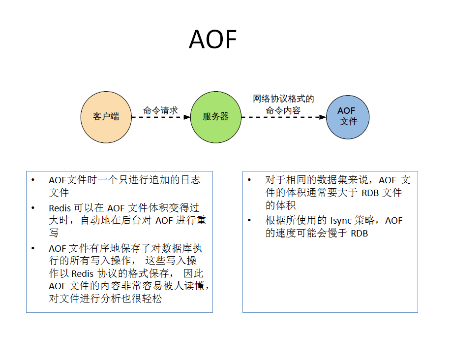

### 9、redis的事务

是什么：可以一次执行多个命令，本质是一组命令的集合，一个事务中所有命令都会序列化，**按顺序地串行化执行而不会被其他命令插入，不许加塞**。

能干嘛：一个队列中，一次性，顺序性，排他性的执行一系列命令。

怎么玩：MULTI开启,不一定开启成功;EXEC执行，DISCARD丢弃事务;WATCH监控一个或多个key，如果在事务执行之前这些key被其他命令所改动，那么事务将被打断

**redis对事务的支持是部分支持**，在执行事务的过程就报错会牵连所有操作，但在执行事务时才报错则不会影响其他的操作


表锁、行锁，列锁，间隙锁

### 10、redis的发布订阅

参考：https://blog.csdn.net/w05980598/article/details/80444717

1. 概念：进程间的一种消息通信模式，发送者（pub）发送消息，订阅者（sub）接收消息

PUBLISH:


SUBSCRIBE:

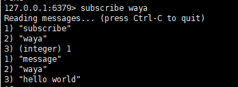

> 针对于有共同前缀的多个channel的订阅，只需将subscribe改成psubscribe channe*即可

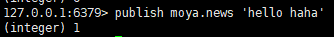

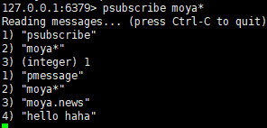

取消订阅：UNSUBSCRIBE、PUNSUBSCRIBE

优点：
> - 典型的广播模式，一个消息可以发布到多个消费者
> - 多信道订阅，消费者可以同时订阅多个信道，从而接收多类消息
> - 消息即时发送，消息不用等待消费者读取，消费者会自动接收到信道发布的消息

缺点:
> - 消息一旦发布，不能接收。换句话就是发布时若客户端不在线，则消息丢失，不能寻回
> - 不能保证每个消费者接收的时间是一致的
> - 若消费者客户端出现消息积压，到一定程度，会被强制断开，导致消息意外丢失。通常发生在消息的生产远大于消费速度时

**总结：可见，Pub/Sub 模式不适合做消息存储，消息积压类的业务，而是擅长处理广播，即时通讯，即时反馈的业务**

补充：

**List结构可实现消息队列，和发布订阅可作同样的功能，List支持多个生产者和消费者并发进出消息，每个消费者拿到都是不同的列表元素，但针对List的读，需改为brpop和blpop实现阻塞读取，原先的lpop和rpop实现读取时，在当队列为空，会一直空轮询直至有数据，消耗资源，而blpop和brpop阻塞读在队列没有数据的时候进入休眠状态，一旦数据到来则立刻醒过来，消息延迟几乎为零，但这种情况无法避免长时间空闲连接的问题，如果线程一直阻塞在那里，Redis客户端的连接就成了闲置连接，闲置过久，服务器一般会主动断开连接，减少闲置资源占用，这个时候blpop和brpop或抛出异常，所以在编写客户端消费者的时候要小心，如果捕获到异常，还有重试**

### 11、redis stream

参考1：https://blog.csdn.net/enmotech/article/details/81230531

参考2：https://redis.io/topics/streams-intro

参考3：https://my.oschina.net/u/3049601/blog/1822884

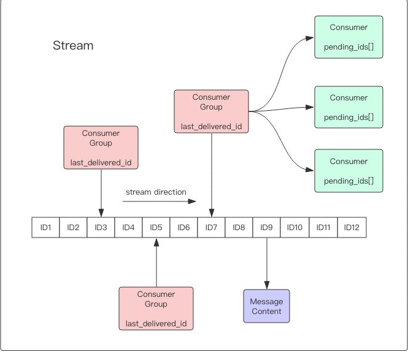

> - Stream为redis 5.0后新增的数据结构。支持多播的可持久化消息队列，实现借鉴了Kafka设计
> - Redis Stream的结构如上图所示，它有一个消息链表，将所有加入的消息都串起来，每个消息都有一个唯一的ID和对应的内容。消息是持久化的，Redis重启后，内容还在
> - 每个Stream都有唯一的名称，它就是Redis的key，在我们首次使用xadd指令追加消息时自动创建
> - 每个Stream都可以挂多个消费组，每个消费组会有个游标last_delivered_id在Stream数组之上往前移动，表示当前消费组已经消费到哪条消息了。每个消费组都有一个Stream内唯一的名称，消费组不会自动创建，它需要单独的指令xgroup create进行创建，需要指定从Stream的某个消息ID开始消费，这个ID用来初始化last_delivered_id变量
> - 每个消费组(Consumer Group)的状态都是独立的，相互不受影响。也就是说同一份Stream内部的消息会被每个消费组都消费到
> - 同一个消费组(Consumer Group)可以挂接多个消费者(Consumer)，这些消费者之间是竞争关系，任意一个消费者读取了消息都会使游标last_delivered_id往前移动。每个消费者者有一个组内唯一名称
> - 消费者(Consumer)内部会有个状态变量pending_ids，它记录了当前已经被客户端读取的消息，但是还没有ack。如果客户端没有ack，这个变量里面的消息ID会越来越多，一旦某个消息被ack，它就开始减少。这个pending_ids变量在Redis官方被称之为PEL，也就是Pending Entries List，这是一个很核心的数据结构，它用来确保客户端至少消费了消息一次，而不会在网络传输的中途丢失了没处理

命令：
> - xadd 追加消息
> - xdel 删除消息，这里的删除仅仅是设置了标志位，不影响消息总长度
> - xrange 获取消息列表，会自动过滤已经删除的消息
> - xlen 消息长度
> - del 删除Stream

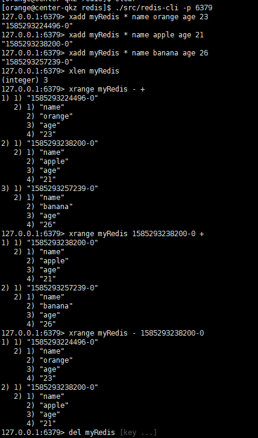

独立消费：
> - 我们可以在不定义消费组的情况下进行Stream消息的独立消费，当Stream没有新消息时，甚至可以阻塞等待。Redis设计了一个单独的消费指令xread，可以将Stream当成普通的消息队列(list)来使用。使用xread时，我们可以完全忽略消费组(Consumer Group)的存在，就好比Stream就是一个普通的列表(list)

监听：xread block 0 count 1 streams myRedis $

**block 0表示永远阻塞，直到消息到来，block 1000表示阻塞1s，如果1s内没有任何消息到来，就返回nil**

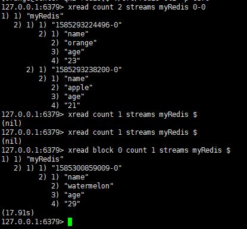


创建消费组：
> - Stream通过xgroup create指令创建消费组(Consumer Group)，需要传递起始消息ID参数用来初始化last_delivered_id变量

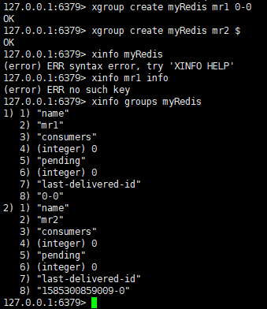

**0-0表示从头消费，$表示从尾部消费**

消费：
> - Stream提供了xreadgroup指令可以进行消费组的组内消费，需要提供消费组名称、消费者名称和起始消息ID。它同xread一样，也可以阻塞等待新消息。读到新消息后，对应的消息ID就会进入消费者的PEL(正在处理的消息)结构里，客户端处理完毕后使用xack指令通知服务器，本条消息已经处理完毕，该消息ID就会从PEL中移除

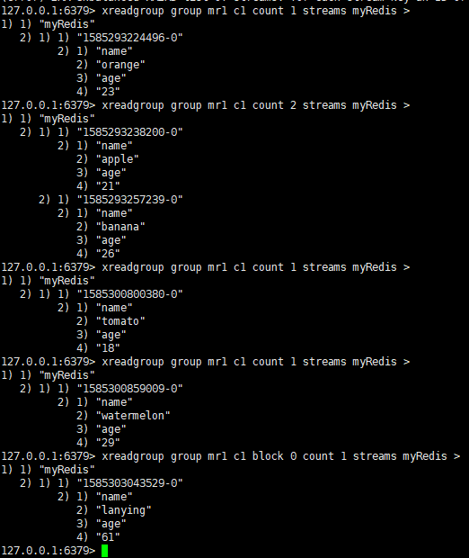

Stream消息过多：
> - redis提供了一个定长Stream功能。在xadd的指令提供一个定长长度maxlen，就可以将老的消息干掉，确保最多不超过指定长度，eg.xadd codehole maxlen 3 * name xiaorui age 1

分区Partition：
> - Redis没有原生支持分区的能力，想要使用分区，需要分配多个Stream，然后在客户端使用一定的策略来讲消息放入不同的stream

总结：
> - Stream的消费模型借鉴了kafka的消费分组的概念，它弥补了Redis Pub/Sub不能持久化消息的缺陷。但是它又不同于kafka，kafka的消息可以分partition，而Stream不行。如果非要分parition的话，得在客户端做，提供不同的Stream名称，对消息进行hash取模来选择往哪个Stream里塞

### 12、redis的主从复制

1. 概念：主机数据更新后根据配置和策略，自动同步到备机的master/slave机制，master以写为主，slave以读为主

2. 如何使用？

> - 配从（库）不配主（库）
> - 从库配置：slaveof 主库ip 主库端口（每次与master断开之后，都需要重新连接，除非你配置进redis.conf文件）
> - 修改配置文件细节操作：拷贝多个(3个)redis.conf文件、开启daemonize yes、修改pid文件、log文件名字修改（logfile "6379"）、dump.rdb文件
> - 常用3招：

    一主二仆：从机读，主机写，如果从机写入和主机一样的会报错，实现读写分离，如果主机挂了，其他两台从机依旧是从机的身份，默认配置，主机重启依旧是主机，从机原地待命，但是如果从机挂掉之后，再重启，该从机会恢复成原来默认的master，需重新设置为master的从机才行

    薪火相传：上一个slave可以是下一个slave的master，slave同样可以接收其他slaves的连接和同步请求，那么该slave作为了链条中下一个的master，可以有效减轻master的写压力，中途变更转向：会清除之前的数据，重新拷贝最新的，SLAVEOF 新机ip:新机端口

    反客为主：SLAVEOF no one（将当前从机设置成为master）

info replication：查看是否为master || slaver的信息

SLAVEOF 127.0.0.1:6379：做6379的slave，作为备份

3. 复制原理：slave启动成功连接到master后会发送一个sync命令，

4. 哨兵模式：
> - 概念：反客为主的自动版，能够后台监控主机是否故障，如果故障了根据投票数自动将从库转换为主库
> - 自定义sentinel.conf文件，vi此文件：sentinel monitor host6379 127.0.0.1 6379 1， 1代表一个哨兵，表示主机挂掉后slave投票看谁成为新的主机，得票数多成为新主机，启动哨兵：Redis-sentinel /myredis/sentinel.conf

相关命令：
> - sentinel monitor mymaster 127.0.0.1 6379 2 // [监控名称] [ip] [port] [多少sentinel同意才发生故障转移]
> - sentinel down-after-milliseconds mymaster 60000 // [监控名称] [Master多少毫秒后不回应ping命令，就认为master是主观下线状态]
> - sentinel failover-timeout mymaster 180000 // [故障转移超时时间]
> - sentinel parallel-syncs mymaster 1 //[在执行故障转移时,最多可以有多少个从服务器同时对新的主服务器进行同步]
> - redis-sentinel sentinel.conf // sentinel需要使用redis2.8版本以上，启动

启动后：
> - 以10秒一次的频率，向被监视的master发送info命令，根据回复获取master当前信息
> - 以1秒一次的频率，向所有redis服务器、包含sentinel在内发送PING命令，通过回复判断服务器是否在线
> - 以2秒一次的频率，通过向所有被监视的master，slave服务器发送包含当前sentinel，master信息的消息

> sentinel至少起3个实例以上，并配置2个实例同意即可发生转移。 5个实例，配置3个实例同意以此类推

复制延时：由于所有的写操作都是先在Master上操作，然后同步更新到Slave上，所以从Master同步到Slave机器有一定的延迟，当系统很繁忙的时候，延迟问题会更加严重，Slave机器数量的增加也会使这个问题更加严重。

5. 主从复制，目的
> - 读写分离
> - 容灾备份


### 命令

1. redis默认安装16个库,redis索引从0开始，选择库：select 0
2. 查看key的数量大小：DBSIZE
3. 罗列所有key：keys *（不推荐用*号，最好用具体的key值，或者keys k?会查看k开头的key）
4. 清除当前一个库的所有key：FLUSHDB
5. 清除所有库的所有key：FLUSHALL（不推荐，有风险）
6. 剪切（将k3这个key移动到2号库中）：move k3 2
7. 给key设置过期时间：EXPIRE key 秒钟
8. 查看还有多少秒过期，-1表示永不过期，-2表示已过期，过期会移除：ttl key
9. 查看key的类型：type key
10. 删除key：DEL key
11. INCR/decr/incrby/decrby：针对数字进行加减，一定要是数字(原子性操作)
12. getrange/setrange（eg.GETRANGE k1 0 -1)：截取字符串
13. setex（set with expire） 键秒值/setnx（set if no exist）键不存在才会设置：设置过期时间
14. 合并设置值：mset k1 v1 k2 v2 k3 v3(当且仅当所有key不存在时，设置才生效)
15. 先get再set，以新换旧，设置了新值同时获得旧值：getset
16. lpush/rpush/lrange：新增值，左边先进/新增值，右边先进/获取某个范围中的值，做右边出来（lrange k1 0 -1）
17. lpop/rpop（lpop list01）：每次出一个值，先出栈顶
18. lindex，按照索引下标获得元素（从上到下）：lindex list01 2
19. llen：获取列表长度
20. lrem key：删除n个value，lrem list01 2 3（删除2个3）
21. ltrim key：开始index，结束index，截取指定范围的值后再赋值给key，eg ltrim list1 3 5
22. rpoplpush：rpoplpush list01 list02 
23. lset key index value
24. linsert key before/after 值1 值2：把某个值插入某个key中

25. sadd/smembers/sismember：新增值/查看值/
26. scard：获取集合里面的元素个数
27. srem key value：删除集合中元素 srem set01 3 删除3
28. srandmember key：某个整数（随机出几个数）
29. spop key：随机出栈
30. smove key1 key2 在key1里某个值：作用是将key1里的某个值赋给key2
31. 数学集合类：

    差集：sdiff（sdiff set01 set02）：在第一个集合里面并且不在第二个集合里

    交集：sinter

    并集：sunion

32. hset/hget/hmset/hmget/hgetall/hdel：eg hset user name z3(user为key，name和z3为value，并且是一个键值对)
33. exists查看是否存在某个key

## 2019版

### 1、NoSQL(not only sql)

不依赖业务逻辑方式存储，而以简单的k/v形式存储，因此大大的增加了数据库的扩展能力，不遵循sql标准，不支持ACID，远超于sql的性能。

适用场景：对数据高并发的读写、海量数据的读写、对数据可扩展性的读写

不适用场景：需要事务支持（和ACID无关）、基于sql的结构化查询存储，处理复杂的关系，需要即席查询（条件查询）

### 2、redis单线程+多路IO复用技术

多路复用是指适用一个线程检查多个文件描述符（socket）的就绪状态，比如调用select和poll函数，传入多个文件描述符，如果有一个文件描述符就绪，则返回，否则阻塞直到超时，得到就绪状态后进行真正的操作可以在同一个线程里执行，也可以启动线程执行（比如适用线程池）

串行 vs 多线程+锁（memcached）
单线程+多路IO复用（redis）

### 3、tcp-backlog

理解时一个请求到达后至到接收进程处理前的队列

backlog队列综合=未完成三次握手队列 + 已完成三次握手队列

高并发环境tcp-backlog设置值跟超时时限内的redis吞吐量决定

吞吐：redis处理请求的的速度

处理请求的速度快，此值可设置大一些，反之不可

### 4、设置密码

config set requirepass "123456"

登录：auth "123456"


maxmemory-samples：设置样本数量，lru算法和最小ttl算法都并非时精确的算法，二十估算值，所以可以设置样本的大小，一般设置3-7的数字，数值越小样本越不精确，但是性能消耗也越小

### 6、redis事务

redis事务是一个单独的隔离操作，事务中的所有命令都会序列化，按顺序地执行，事务在执行的过程中，不会被其他客户端发送来的命令请求所打断

redis事务的主要作用就是串联多个命令防止别的命令插队

redis 乐观锁，cas check and set，加一个版本号用于比较，只要数据发生变化就会修改版本号，只要发现版本号不一致就不会继续往下执行

关系型数据库一般为悲观锁，分为行锁、表锁等

watch监视某个key，在key监视过程中，某个key的值发生改变，与监视时的值不同，那么该key对应的事务将会失败

特性：
> - 单独的隔离操作：事务中的所有命令都会序列化，按顺序地执行，事务在执行的过程中，不会被其他客户端发送来的命令请求所打断
> - 没有隔离级别的概念：队列中的命令没有提交之前都不会实际的被执行，因为事务提交前任何指令都不会被实际执行，也就不存在“事务内的查询要看到事务里的更新，在事务外查询不能看到”这个让人万分头痛的问题
> - 不保证原子性：redis同一个事务中如果有一条命令执行失败，其后的命令仍然会被执行，没有回滚

### 7、redis持久化

rdb：
> - stop-writes-on-bgsave-error yes：当redis无法写入磁盘的话，直接关掉redis的写操作
> - rdbcompression yes：进行rdb保存时，将文件压缩
> - rdbchecksum yes：在存储快照后，还可以让redis使用crc64算法来进行数据校验，但是这样做会增加大约10%的性能消耗，如果希望获取到最大的性能提升，可以关闭此功能

rdb优点：
> - 节省磁盘空间（仅对比aof来说）
> - 恢复速度快

rdb缺点:
> - 虽然redis在fork时使用了写时拷贝技术，但是如果数据庞大时还是比较消耗性能
> - 在备份周期在一定间隔时间做一次备份，所以如果redis意外down掉的话，就会丢失最后一次快照后的所有修改

aof同步频率设置

rewrite：当aof文件的大小超过所设定的阈值时，redis就会启动aof文件的内容压缩，只保留可以恢复数据的最小指令集，bgrewrite指令实现

redis如何实现重写？

aof文件持续增长而过大时，会fork出一条新进程来将文件重写（也是先写临时文件最后再rename，遍历新进程的内存数据，每条记录有一条的set语句，重写aof文件的操作，并没有读取旧的aof文件，而是将整个内存中的数据库内容用命令的方式重写了一个新的aof文件，类似快照

### 8、配从不配主

拷贝多个redis.conf文件include
开启daemonize yes
pid文件名字pidfile
指定端口port
log文件名字修改
dump.rdb名字dbfilename
appendonly关掉或者换名字


1. 容量不够，redis如何进行扩容

2. 并发写操作，redis如何分摊

redis集群实现了redis的水平扩容，即启动N个redis节点，将整个数据库分布存储在这N个节点中，每个节点存储总数居的1/N

redis集群通过分区partition来提供一定程度的可用性，即使集群中有一部分节点失效或者无法进行通讯，集群也可以继续处理命令请求

### 9、数据同步
> - 同步方式：当主机收到客户端写操作后，以同步方式把数据同步到从机上，当从机也成功写入后，主机才返回给客户端成功，也称数据强一致性。 很显然这种方式性能会降低不少，当从机很多时，可以不用每台都同步，主机同步某一台从机后，从机再把数据分发同步到其他从机上，这样提高主机性能分担同步压力。 在Redis中是支持这杨配置的，一台master，一台slave，同时这台salve又作为其他slave的master
> - 异步方式：主机接收到写操作后，直接返回成功，然后在后台用异步方式把数据同步到从机上。 这种同步性能比较好，但无法保证数据的完整性，比如在异步同步过程中主机突然宕机了，也称这种方式为数据弱一致性

Redis主从同步采用的是异步方式，因此会有少量丢数据的危险。还有种弱一致性的特例叫最终一致性，这块详细内容可参见CAP原理及一致性模型。

高可用（High Availability）：是当一台服务器停止服务后，对于业务及用户毫无影响。 停止服务的原因可能由于网卡、路由器、机房、CPU负载过高、内存溢出、自然灾害等不可预期的原因导致，在很多时候也称单点问题

解决单点问题的方案：
> - 主备方式：使用keepalived，它使主机备机对外提供同一个虚拟IP，客户端通过虚拟IP进行数据操作，正常期间主机一直对外提供服务，宕机后VIP自动漂移到备机上
>> - 优点：对客户端毫无影响，仍然通过VIP操作
>> - 缺点：在绝大多数时间内备机是一直没使用，被浪费着的
> - 主从方式：这种采取一主多从的办法，主从之间进行数据同步。 当Master宕机后，通过选举算法(Paxos、Raft)从slave中选举出新Master继续对外提供服务，主机恢复后以slave的身份重新加入。主从另一个目的是进行读写分离，这是当单机读写压力过高的一种通用型解决方案。 其主机的角色只提供写操作或少量的读，把多余读请求通过负载均衡算法分流到单个或多个slave服务器上
>> - 缺点：主机宕机后，Slave虽然被选举成新Master了，但对外提供的IP服务地址却发生变化了，意味着会影响到客户端。 解决这种情况需要一些额外的工作，在当主机地址发生变化后及时通知到客户端，客户端收到新地址后，使用新地址继续发送新请求

### 10、redis cluster

参考：http://www.redis.cn/topics/cluster-tutorial.html

集群：
> redis集群实现了对redis的水平扩容，即启动N个redis节点，将整个数据库分布存储在这个N个节点中，每个节点存储总数居的1/N
> redis集群通过分区（partition）来提供一定程度的可用性（availability）：即使集群中有一部分节点失效或者无法进行通讯，集群也可以继续处理命令请求

redis集群分片
> - 集群将整个数据库分为16384个槽位slot，key的槽位计算公式为slot_number=crc16(key)%16384
> - 集群中的每个主节点都可以处理0个至16383个槽，当16384个槽都有某个节点在负责处理时，集群进入上线状态，并开始处理客户端发送的数据命令请求
eg.
> - 节点A包含0-5500哈希槽
> - 节点B包含5501-11000号哈希槽
> - 节点C包含11001到16384哈希槽

Redis集群一致性保证（Redis Cluster consistency guarantees）：Redis集群不能保证强一致性，Redis集群可能丢失写的第一个原因是因为采用异步复制
> - 客户端写到master B
> - master B给客户端回复ok
> - master B将这个写操作广播给slaves B1 B2 B3

> 主节点对命令的复制工作发生在返回命令回复之后， 因为如果每次处理命令请求都需要等待复制操作完成的话， 那么主节点处理命令请求的速度将极大地降低 —— 我们必须在性能和一致性之间做出权衡。 注意：Redis 集群可能会在将来提供同步写的方法。 Redis 集群另外一种可能会丢失命令的情况是集群出现了网络分区， 并且一个客户端与至少包括一个主节点在内的少数实例被孤立。
举个例子 假设集群包含 A 、 B 、 C 、 A1 、 B1 、 C1 六个节点， 其中 A 、B 、C 为主节点， A1 、B1 、C1 为A，B，C的从节点， 还有一个客户端 Z1 假设集群中发生网络分区，那么集群可能会分为两方，大部分的一方包含节点 A 、C 、A1 、B1 和 C1 ，小部分的一方则包含节点 B 和客户端 Z1 .
Z1仍然能够向主节点B中写入, 如果网络分区发生时间较短,那么集群将会继续正常运作,如果分区的时间足够让大部分的一方将B1选举为新的master，那么Z1写入B中得数据便丢失了.
注意， 在网络分裂出现期间， 客户端 Z1 可以向主节点 B 发送写命令的最大时间是有限制的， 这一时间限制称为节点超时时间（node timeout）， 是 Redis 集群的一个重要的配置选项

集群环境：安装ruby环境

> - port 6379
> - cluster-enabled yes 打开集群模式
> - cluster-config-file nodes-6379.conf 设定节点配置文件名
> - cluster-node-timeout 15000 设定节点失联时间，超过改时间（毫秒），集群自动进行主从切换
> - appendonly yes 打开aof持久化

redis cluster如何分配节点：
> - 一个集群至少要有三个主节点
> - 选项 --replicas 1 表示我们希望为集群中的每个主节点创建一个从节点
> - 分配原则尽量保证每个主数据库运行在不同的ip地址，每个从库和主库不在一个ip地址上

在集群中添加值
> - 在redis-cli每次录入、查询键值，redis都会计算出该key应该送往的插槽，如果不是该客户端对应服务器的插槽，redis会报错，并告知应前往的redis实例地址和端口
> - redis-cli客户端提供了-c参数实现自动重定向，eg redis-cli -c -p 6379登入后，再录入，查询键值对可以自动重定向
> - 不在一个slot下的键值，是不能使用mget、mset等多键操作
> - 可以通过{}来定义组的概念，从而使key中{}内相同内容的键值对放到一个slot中去：set a{user} 1 、 set aa{user} 2

故障恢复：
> - 如果主节点下线，从节点自动升为主节点，待主节点恢复后，将作为新主节点的从节点存在
> - 如果某一段插槽的主从节点都宕掉了，redis集群服务不能继续使用，除非设置redis.conf中的参数cluster-require-full-coverage yes (此参数代表16384个slot都正常的时候才能对外提供服务)

redis集群模式：
> - 主从模式
> - 哨兵模式（sentinel）
> - 集群模式（Cluster）

> 3.0之前哨兵只监控master和slaves节点，3.0之后，redis主节点角色变了，既是主节点，也是哨兵。一旦主节点挂了，slave立刻提升为master。横向的3个节点扩充存储能力，根据哈希槽来进行sharding分片，散列在不同主节点上。然后每个主节点都有从节点。两者的结合，既能保证横向存储扩展能力（切片），又能保证纵向的高可用（镜像全量）


相关命令：
> - cluster-enabled yes  --开启集群
> - cluster-config-file nodes-6382.conf --集群配置文件名
> - cluster info ：打印集群的信息
> - cluster nodes ：列出集群当前已知的所有节点（ node），以及这些节点的相关信息
> - cluster meet <ip> <port> ：将 ip 和 port 所指定的节点添加到集群当中，让它成为集群的一份子
> - cluster forget <node_id> ：从集群中移除 node_id 指定的节点
> - cluster replicate <node_id> ：将当前节点设置为 node_id 指定的节点的从节点
> - cluster saveconfig ：将节点的配置文件保存到硬盘里面
> - cluster addslots <slot> [slot ...] ：将一个或多个槽（ slot）指派（ assign）给当前节点
> - cluster delslots <slot> [slot ...] ：移除一个或多个槽对当前节点的指派
> - cluster flushslots ：移除指派给当前节点的所有槽，让当前节点变成一个没有指派任何槽的节点
> - cluster setslot <slot> node <node_id> ：将槽 slot 指派给 node_id 指定的节点，如果槽已经指派给另一个节点，那么先让另一个节点删除该槽>，然后再进行指派
> - cluster setslot <slot> migrating <node_id> ：将本节点的槽 slot 迁移到 node_id 指定的节点中
> - cluster setslot <slot> importing <node_id> ：从 node_id 指定的节点中导入槽 slot 到本节点
> - cluster setslot <slot> stable ：取消对槽 slot 的导入（ import）或者迁移（ migrate）
> - cluster keyslot <key> ：计算键 key 应该被放置在哪个槽上
> - cluster countkeysinslot <slot> ：返回槽 slot 目前包含的键值对数量
> - cluster getkeysinslot <slot> <count> ：返回 count 个 slot 槽中的键

> 如果master B给客户端回复ok之后，在将写操作广播给slaves之前，master B挂掉了，就会导致这一次的写操作丢失

### 11、slot

一个redis集群包含16384个插槽（slot）

redis-cli -c：会实现自动重定向，不是一个slot下的键值，是不能使用mget、mset等多键操作

可以通过{}来定义组的概念，从而使key中{}内相同内容的键值对放到同一个slot中去，eg.set a{user} 1 or set a{user} 2 都会将值设置在同一个slot

### 12、布隆过滤器

> 本质上布隆过滤器是一种数据结构，比较巧妙的概率型数据结构（probabilistic data structure），特点是高效地插入和查询，可以用来告诉你 “某样东西一定不存在或者可能存在”，相比于传统的 List、Set、Map 等数据结构，它更高效、占用空间更少，但是缺点是其返回的结果是概率性的，而不是确切的

## 额外

### 1、redis分布式锁

使用setnx、getset、expire、del这4个redis命令实现
> - setnx 是『SET if Not eXists』(如果不存在，则 SET)的简写, 命令格式：SETNX key value；使用：只在键 key 不存在的情况下,将键 key 的值设置为 value ,若键 key 已经存在,则 SETNX 命令不做任何动作,返回值：命令在设置成功时返回1,设置失败时返回0
> - getset 命令格式：GETSET key value，将键 key 的值设为 value ，并返回键 key 在被设置之前的旧的value,返回值：如果key没有旧值，也就是说，键key在被设置之前不存在，那么命令返回nil，当key存在但是不是字符串类型时，命令返回一个错误
> - expire 命令格式：EXPIRE key seconds，使用：为给定 key 设置生存时间，当 key 过期时(生存时间为 0 )，它会被自动删除。返回值：设置成功返回 1 。 当 key 不存在或者不能为 key 设置生存时间时(比如在低于 2.1.3 版本的 Redis 中你尝试更新 key 的生存时间)，返回 0 
> - del 命令格式：DEL key [key …]，使用：删除给定的一个或多个 key ，不存在的 key 会被忽略。返回值：被删除 key 的数量。

redis分布式锁原理（1）

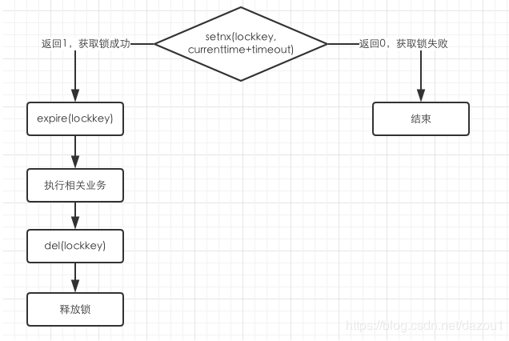

过程分析：
> - A尝试去获取锁lockkey，通过setnx(lockkey,currenttime+timeout)命令，对lockkey进行setnx,将value值设置为当前时间+锁超时时间
> - 如果返回值为1，说明redis服务器中还没有lockkey，也就是没有其他用户拥有这个锁，A就能获取锁成功
> - 在进行相关业务执行之前，先执行expire(lockkey)，对lockkey设置有效期，防止死锁。因为如果不设置有效期的话，lockkey将一直存在于redis中，其他用户尝试获取锁时，执行到setnx(lockkey,currenttime+timeout)时，将不能成功获取到该锁
> - 执行相关业务
> - 释放锁，A完成相关业务之后，要释放拥有的锁，也就是删除redis中该锁的内容，del(lockkey)，接下来的用户才能进行重新设置锁新值

redis 分布式锁原理2(优化版)，双重防死锁

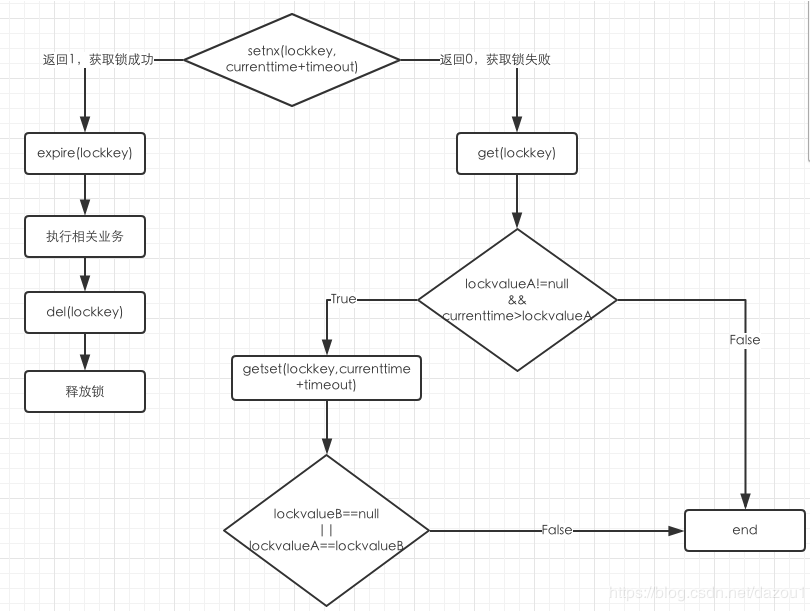

过程分析：
> - 当A通过setnx(lockkey,currenttime+timeout)命令能成功设置lockkey时，即返回值为1，过程与原理1一致
> - 当A通过setnx(lockkey,currenttime+timeout)命令不能成功设置lockkey时，这是不能直接断定获取锁失败；因为我们在设置锁时，设置了锁的超时时间timeout，当当前时间大于redis中存储键值为lockkey的value值时，可以认为上一任的拥有者对锁的使用权已经失效了，A就可以强行拥有该锁；具体判定过程如下
> - A通过get(lockkey)，获取redis中的存储键值为lockkey的value值，即获取锁的相对时间lockvalueA
> - lockvalueA!=null && currenttime>lockvalue，A通过当前的时间与锁设置的时间做比较，如果当前时间已经大于锁设置的时间临界，即可以进一步判断是否可以获取锁，否则说明该锁还在被占用，A就还不能获取该锁，结束，获取锁失败
> - 步骤4返回结果为true后，通过getSet设置新的超时时间，并返回旧值lockvalueB，以作判断，因为在分布式环境，在进入这里时可能另外的进程获取到锁并对值进行了修改，只有旧值与返回的值一致才能说明中间未被其他进程获取到这个锁
> - lockvalueB == null || lockvalueA==lockvalueB，判断：若果lockvalueB为null，说明该锁已经被释放了，此时该进程可以获取锁；旧值与返回的lockvalueB一致说明中间未被其他进程获取该锁，可以获取锁；否则不能获取锁，结束，获取锁失败

参考文章：https://blog.csdn.net/dazou1/article/details/88088223

### 2、redis通讯协议

> - RESP（REdis Serialization Protocol），RESP 是redis客户端和服务端之前使用的一种通讯协议，
> - RESP 是redis客户端和服务端之前使用的一种通讯协议；
> - RESP 的特点：实现简单、快速解析、可读性好
> - For Simple Strings the first byte of the reply is "+" 回复
> - For Errors the first byte of the reply is "-" 错误
> - For Integers the first byte of the reply is ":" 整数
> - For Bulk Strings the first byte of the reply is "$" 字符串
> - For Arrays the first byte of the reply is "*" 数组